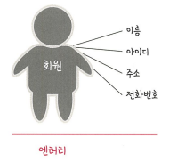
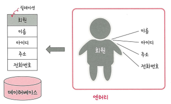
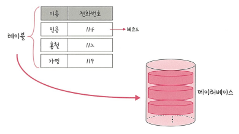

# 4.데이터베이스
## 4.1 데이터베이스의 기본
데이터베이스(DB)
- 일정한 규칙, 규약을 통해 구조화 되어 저장되는 **데이터의 모음**
- **실시간 접근**과 **동시 공유**가 가능

데이터베이스 관리 시스템(DBMS)
- 데이터베이스를 **제어**, **관리**하는 통합 시스템
- 데이터베이스 안에 있는 데이터들은 특정 DBMS마다 정의된 쿼리 언어를 통해 **삽입(C)**, **삭제(D)**, **수정(U)**, **조회(R)** 등을 수행

  
위 그림처럼 데이터를 주고 받음  
예시, DBMS(MySQL) / 응용프로그램(Node, php) / 데이터베이스(데이터의 모음)  

```
데이터베이스 안에 있는 데이터를 DBMS를 통해 가져오고 응용 프로그램에서 해당 데이터 관련 로직을 구축
```

<br>

### 4.1.1 엔터티
사람, 장소, 물건 등 여러개의 속성을 지닌 **현실 세계의 개념적 대상**



예를들어, 회원 엔터티가 있다면 회원의 이름, 아이디, 주소, 전화번호는 속성값에 해당됨


<br>

### 4.1.2 릴레이션
데이터베이스에서 **정보를 구분하여 저장**하는 기본 단위  
엔터티에 관한 데이터를 데이터에비스는 릴레이션 하나에 담아서 관리



추가 정보
```
*이미지 참고
엔터티 : 테이블의 대상(회원)
릴레이션 : 테이블(회원 테이블)
속성 : 컬럼(이름, 아이디, 주소, 전화번호)
인스턴스 : 로우(회원 한명의 데이터)
```
<br>

#### 테이블과 컬렉션
릴레이션은 관계형 데이터베이스에서는 '테이블'이라고 하며, NoSQL에서는 '컬렉션'이라고 함  

구조의 차이 예시  
MySQL(관계형 데이터베이스) : 레코드-**테이블**-데이터베이스  
MongoDB(NoSQL) : 도큐먼트-**컬렉션**-데이터베이스  
  
레코드가 쌓여서 테이블이 되고 테이블이 쌓여서 데이터베이스가 됨

<br>

### 4.1.3 속성
릴레이션에서 관리하는 구체적이면 **고유한 이름**을 갖는 정보  

예시  
엔터티 : 차  
속성 : 바퀴 수, 색깔, 차종 등

### 4.1.4 도메인
