# 4.데이터베이스
## 4.1 데이터베이스의 기본
데이터베이스(DB)
- 일정한 규칙, 규약을 통해 구조화 되어 저장되는 **데이터의 모음**
- **실시간 접근**과 **동시 공유**가 가능

데이터베이스 관리 시스템(DBMS)
- 데이터베이스를 **제어**, **관리**하는 통합 시스템
- 데이터베이스 안에 있는 데이터들은 특정 DBMS마다 정의된 쿼리 언어를 통해 **삽입(C)**, **삭제(D)**, **수정(U)**, **조회(R)** 등을 수행

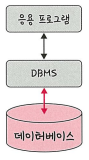

위 그림처럼 데이터를 주고 받음  
예시, DBMS(MySQL) / 응용프로그램(Node, php) / 데이터베이스(데이터의 모음)  

```
데이터베이스 안에 있는 데이터를 DBMS를 통해 가져오고 응용 프로그램에서 해당 데이터 관련 로직을 구축
```

<br>

### 4.1.1 엔터티
사람, 장소, 물건 등 여러개의 속성을 지닌 **현실 세계의 개념적 대상**

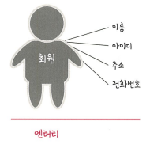

예를들어, 회원 엔터티가 있다면 회원의 이름, 아이디, 주소, 전화번호는 속성값에 해당됨


<br>

### 4.1.2 릴레이션
데이터베이스에서 **정보를 구분하여 저장**하는 기본 단위  
엔터티에 관한 데이터를 데이터에비스는 릴레이션 하나에 담아서 관리

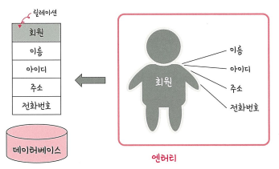

추가 정보
```
*이미지 참고
엔터티 : 테이블의 대상(회원)
릴레이션 : 테이블(회원 테이블)
속성 : 컬럼(이름, 아이디, 주소, 전화번호)
인스턴스 : 로우(회원 한명의 데이터)
```
<br>

#### 테이블과 컬렉션
릴레이션은 관계형 데이터베이스에서는 '테이블'이라고 하며, NoSQL에서는 '컬렉션'이라고 함  

구조의 차이 예시  
MySQL(관계형 데이터베이스) : 레코드-**테이블**-데이터베이스  
MongoDB(NoSQL) : 도큐먼트-**컬렉션**-데이터베이스  
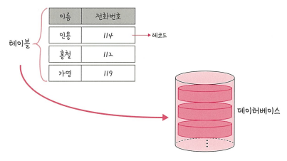

레코드가 쌓여서 테이블이 되고 테이블이 쌓여서 데이터베이스가 됨

<br>

### 4.1.3 속성
릴레이션에서 관리하는 구체적이면 **고유한 이름**을 갖는 정보  

예시  
엔터티 : 차  
속성 : 바퀴 수, 색깔, 차종 등

<br>

### 4.1.4 도메인
릴레이션에 포함된 각각의 속성들이 가질 수 있는 값의 **집합**

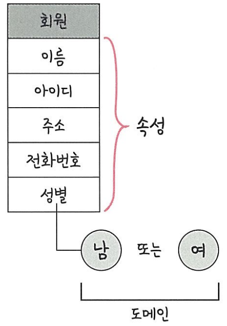

예시  
릴레이션 : 회원  
속성 : 이름, 아이디, 주소, 전화번호, 성별  
속성 값 : 성별(남,여)

<br>

### 4.1.5 필드와 레코드
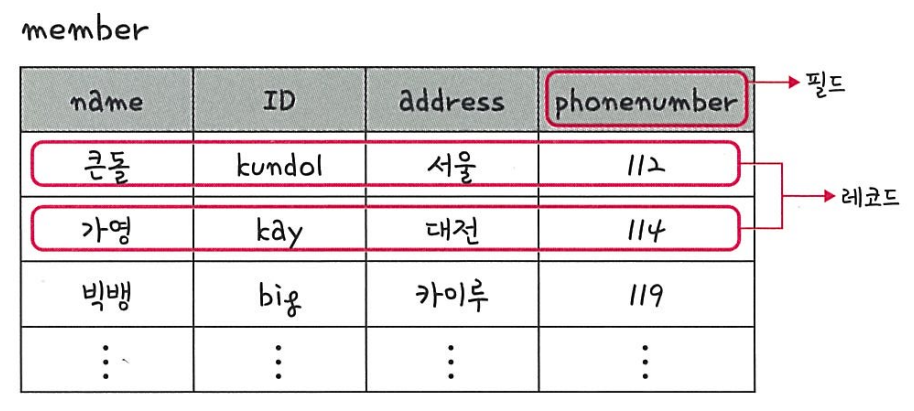

엔터티와 릴레이션, 속성을 가지고 테이블로 구현 -> 테이블, 필드, 레코드

엔터티 : 회원   
테이블 : member  
속성 : 이름, 아이디, 주소 등  
**필드** : name, ID, adress 등  
**레코드(튜플)** : 행 데이터  

또한, 위와 같은 테이블로 구현할 떄에 속성에 맞는 타입 지정 필요 -> 필드는 타입을 가짐

```
*MySQL 기준
ID : INT  
name : VERCHAR(255)  
adress : VERCHAR(255)  
phonenumber : INT  
created_at : DATETIME

테이블 생성 쿼리
CREATE TABLE MEMBER(
    ID INT NOT NULL AUTO_INCREMENT,
    name VARCHAR(255),
    adress VARCHAR(255),
    phonenumber INT,
    created_at DATETIME,
    PRIMARY KEY (id)
);
```

#### 4.1.5.1 필드 타입

추가 정보  
*실무에서 자주 쓰이는 타입 강조 표시함
<table style="border: 2px;">
  <tr>
    <td></td>
    <th colspan="3"> MySQL </th>
    <th colspan="3"> Oracle </th>
  </tr>
  <tr>
    <th> 구분 </th>
    <th> 타입 </th>
    <th> 용량(바이트) </th>
    <th> 범위 </th>
    <th> 타입 </th>
    <th> 용량(바이트) </th>
    <th> 범위 </th>
  </tr>
  <tr>
    <th rowspan="2"> 문자 </th>
    <td style="color:#00c4cc;"> CHAR </td>
    <td > 1 </td>
    <td> 0 ~ 255 </td>
    <td style="color:#00c4cc;"> CHAR </td>
    <td> 1 </td>
    <td> 0 ~ 2000 </td>
  </tr>
  <tr>
    <td style="color:#00c4cc;"> VARCHAR </td>
    <td> 1 </td>
    <td> 0 ~ 65535 </td>
    <td style="color:#00c4cc;"> VARCHAR2 </td>
    <td> 1 </td>
    <td> 0 ~ 4000 </td>
  </tr>
  <tr>
    <th rowspan="5"> 정수 </th>
    <td> TINYINT </td>
    <td> 1 </td>
    <td> -128 ~ 127 </td>
    <td rowspan="5" style="color:#00c4cc;"> NUMBER </td>
    <td rowspan="5"> 1 ~ 22 (가변) </td>
    <td rowspan="5"> -10^125 ~ 10^125 </td>
  </tr>
  <tr>
    <td> SMALLINT </td>
    <td> 2 </td>
    <td> -32768 ~ 32767 </td>
  </tr>
  <tr>
    <td> MEDIUMINT </td>
    <td> 3 </td>
    <td> -8388608 ~ 8388607 </td>
  </tr>
  <tr>
    <td style="color:#00c4cc;"> INT(INTEGER) </td>
    <td> 4 </td>
    <td> -2147483648 ~ 2147483647 </td>
  </tr>
  <tr>
    <td style="color:#00c4cc;"> BIGINT </td>
    <td> 8 </td>
    <td> -263 ~ 263-1 </td>
  </tr>
  <tr>
    <th rowspan="3"> 실수 </th>
    <td style="color:#00c4cc;"> FLOAT </td>
    <td> 4 </td>
    <td> ±3.402823×10^38 </td>
    <td> BINARY_FLOAT </td>
    <td> 4 </td>
    <td> ±3.40282347E+38 </td>
  </tr>
  <tr>
    <td> DECIMAL </td>
    <td> 가변 </td>
    <td> -10^38+1 ~ 10^38-1 </td>
    <td style="color:#00c4cc;"> NUMBER </td>
    <td> 1 ~ 22 (가변) </td>
    <td> 10^125 ~ 10^125 </td>
  </tr>
  <tr>
    <td style="color:#00c4cc;"> DOUBLE </td>
    <td> 8 </td>
    <td> ±1.797693×10^308 </td>
    <td> BINARY_DOUBLE </td>
    <td> 8 </td>
    <td> ±1.7976931348623157E+308 </td>
  </tr>
  <tr>
    <th rowspan="6"> 날짜 </th>
    <td> YEAR </td>
    <td> 1 </td>
    <td> 1970 ~ 2038 </td>
    <td style="color:#00c4cc;"> DATE </td>
    <td> 7 </td>
    <td> 기원전 4712-01-01 ~ 서기 9999-12-31 </td>
  </tr>
  <tr>
    <td style="color:#00c4cc;"> DATE </td>
    <td> 3 </td>
    <td> 1000-01-01 ~ 9999-12-31 </td>
    <td> INTERVAL_YEAR </td>
    <td> 11 </td>
    <td> -999999999-11 ~ +999999999-11 </td>
  </tr>
  <tr>
    <td> TIME </td>
    <td> 3 </td>
    <td> 00:00:00 ~ 23:59:59</td>
    <td> INTERVAL_DAY </td>
    <td> 11 </td>
    <td> -999999999 23:59:59.999999 ~ +999999999 23:59:59.999999 </td>
  </tr>
  <tr>
    <td> TIMESTAMP </td>
    <td> 4 </td>
    <td> 1970-01-01 00:00:01 ~ 2038-01-19 03:14:07</td>
    <td> TIMESTAMP </td>
    <td> 7 ~ 11 </td>
    <td> 기원전 4712년 1월 1일 ~ 서기 9999년 12월 31일 23:59:59.999999 </td>
  </tr>
  <tr>
    <td style="color:#00c4cc;"> DATETIME </td>
    <td> 8 </td>
    <td> 1000-01-01 00:00:00 ~ 9999-12-31 23:59:59</td>
    <td> TIMESTAMP_WITH TIME ZONE </td>
    <td> 13 </td>
    <td> DATE + TIMEZONE 포함 (UTC±14까지) </td>
  </tr>
  <tr>
    <td> </td>
    <td> </td>
    <td> </td>
    <td> TIMESTAMP_WITH LOCAL TIME ZONE </td>
    <td> 11 ~ 13 </td>
    <td> TIMEZONE 자동 변환 포함 </td>
  </tr>
</table>

#### CHAR vs VARCHAR
- CHAT : **고정 길이** 문자열, CHAR(100) 선언 시 -> 10글자를 저장해도 100바이트로 저장됨
- VARCHAR : **가변 길이** 문자열, VARCHAT(10000) 선언 시 -> 10글자를 저장하면 (10 + 1)바이트로 저장됨

따라서, CHAR는 유동적이지 않은 **고정 길이**에서 사용하고 VARCHAR는 **유동적인 길이**에서 사용

#### TEXT vs BLOB  

두 타입 모두 큰 데이터 저장 시 사용
- TEXT : **큰 문자열** 저장, 주로 게시판의 본문 저장시 사용
- BLOB : 이미지, 동영상 등 **큰 데이터** 저장, 서버에 파일을 올리고 파일에 관한 경로 저장 시 사용

#### ENUM vs SET

- 문자열을 열거한 타입
- ('x-small', 'small', 'medium', 'large', 'x-large') 형태로 쓰이며 0, 1로 매핑되어 메모리를 적게 사용
- ENUM : **단일** 데이터를 선택, 최대 65,635개의 요소를 포함 가능
- SET : **여러개의 데이터**를 선택, 비트 단위 연산 가능, 최대 64개의 요소를 포함 가능

공통점
- 공간적으로 이점을 가짐
- 수정에 따라 정의한 목록도 수정해야하는 단점을 가짐

<br>

### 4.1.6 관계

테이블간의 서로 관계를 표시한 것을 **관계 화살표**라고 정의함


추가 정보  
*자료에 있는 예시로는 내용이 부족하여 새로운 예시 제작

#### 1:1 관계
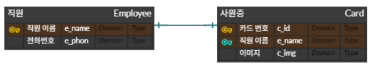

한명의 직원당 한개의 사원증만 존재

#### 1:N 관계
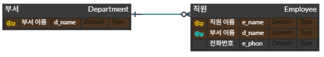

하나의 부서에 여러명의 직원이 존재 가능

#### N:M 관계
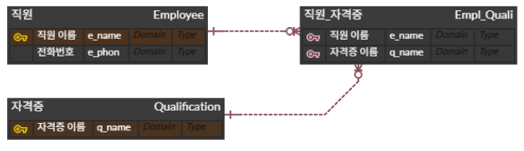

하나의 직원이 여러개의 자격증 소지 가능  
한개의 자격증을 여러명의 직원이 소지 가능

<br>

### 4.1.7 키
테이블 간의 관계를 명확하게 하고 테이블 자체의 인덱스를 위해 설정된 장치  
종류 : 기본키, 외래키, 후보키, 슈퍼키, 대체키

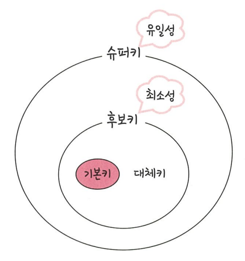

유일성 : 중복되는 값이 없음  
최소성 : 필드를 조합하지 않고 최소 필드만 써서 키를 형성

추가 정보

|      |            중복 불가             | 중복 가능 |
|:----:|:----------------------------:|:-----:|
| 키 종류 | 기본키, 후보키, 대체키, 슈퍼키, 자연키, 인조키 |  외래키  |

#### 기본키
- PK(Primary Key) 또는 프라이머리키 라고 부름
- 유일성과 최소성을 만족
- 자연키 또는 인조키중 택1 필요
  - 자연키 : 중복된 값들을 제외하며 중복되지 않는 것을 자연스케 뽑다가 나오는 키
  - 인조키 : 인위적으로 생성한 키(Oracle : sequence, MySQL : auto increment)

#### 외래키
- FK(Foreign Key) 라고 부름
- 다름 테이블의 기본키를 참조하는 값
- 개체와의 관계 식별에 사용

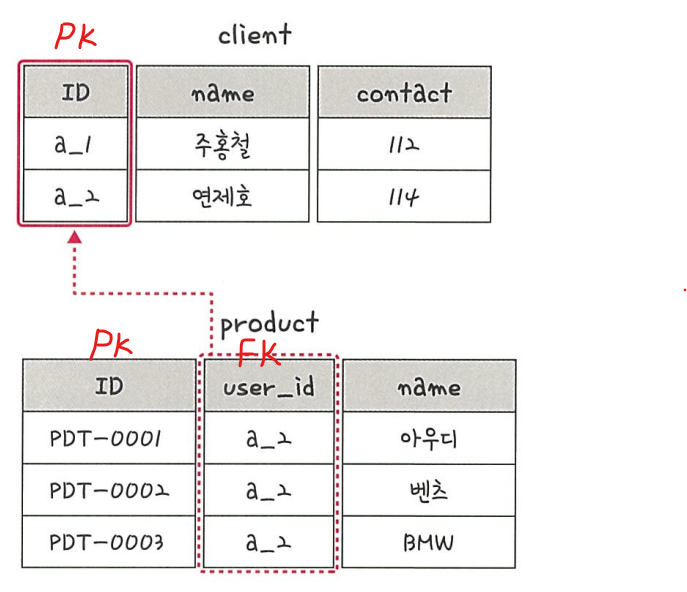

#### 후보키 
- (candidate key)
- 기본키가 될 수 있는 후보
- 유일성과 최소성 동시 만족

#### 대체키
- (alternate key)
- 후보키가 두개 이상일 경우 하나를 기본키로 지정하고 남은 키

#### 슈퍼키
- (super key)
- 각 레코드를 유일하게 식별하게 유일성을 갖춘 키


