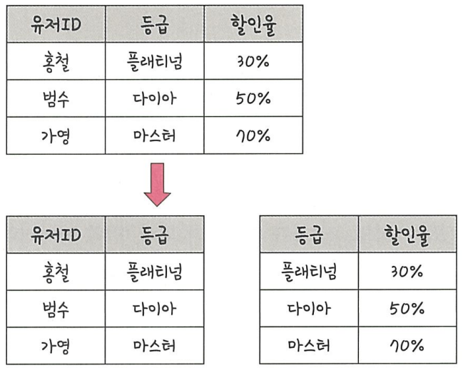

# 4.데이터베이스
## 4.2 ERD와 정규화 과정
ERD(Entity Relationship Diagram)
- 데이터베이스 구축 시 가장 기초적인 **뼈대** 역할
- 릴레이션 간의 관계들을 정의

<br>

### 4.2.1 ERD의 중요성

- ERD를 기반으로 데이터베이스를 구축함
- 장점 : 관계형 구조로 표현할 수 있는 데이터를 구성
- 단점 : 비정형 데이터를 충분히 표현 불가

```
비정형 데이터란?
- 비 구조화 데이터를 지칭
- 미리 정의된 데이터 모델이 없거나 미리 정의된 방식으로 정리되지 않은 정보
```

<br>

### 4.2.2 ERD 예제

예제 1 : 영업부서의 ERD  
요구사항
- 영업사원은 0 ~ n명의 고객을 관리
- 고객은 0 ~ n개의 주문 생성
- 주문에는 1 ~ n개의 상품 보유


예제 2 : 무무오브레전드의 ERD  
요구사항
- 선수들은 1명의 챔피언 선택
- 챔피언은 한 개 이상의 스킬 보유
- 스킬은 한 개 이상의 특성 보유


<br>

### 4.2.3 정규화 과정
릴레이션을 여러개로 분리하는 과정
- **정규형 원칙**을 기반으로 만들어가는 과정
- 정규화된 정보는 **NF**(Normal Form)으로 표현 함 
- 기본 정규형 : 제1정규형, 제2정규형, 제3정규형, 보이스/코드 정규형
- 고급 정규형 : 제4정규형, 제5정규형

```
정규형의 원칙이란?
- 같은 의미를 표현하는 릴레이션이라도 좀 더 좋은 구조로 생성
- 자료의 중복성 최소화
- 독립적인 관계는 별개의 릴레이션으로 표현
- 각각의 릴레이션은 독립적인 표현이 가능해야함
```

사례
- 릴레이션 간의 잘못된 종속 관계로인한 **데이터베이스 이상 현상 발생** 시
- **저장 공간을 효율적으로 사용** 시

```
데이터베이스 이상 현상이란?
1. 회원이 한개의 등급을 가져야하는데 세 개의 등급을 갖거나, 삭제할 때 필요한 데이터가 같이 삭제되는 현상
2. 데이터를 삽입해야 하는데 하나의 필드 값이 NULL이 되면 안되어서 삽입하기 어려운 현상
```

#### 제1정규형
모든 도메인이 더이상 분해될 수 없는 원자 값으로 구성  
릴레이션의 속성 값중에서 **한 개의 기본키**에 대해 **두 개 이상의 값**을 가지는 반복 집합이 있으면 안됨  


초기 테이블(정규화 전)
- 문제점 : 수강명, 성취도의 정보가 두 개 이상의 집합으로 구성됨

집합 데이터 분해 진행(정규화 후)
- 수강명, 성취도의 정보가 한 개의 값을 가지게 됨

<br>

#### 제2정규형
릴레이션이 제1정규형이며, 부분 함수의 종속성을 제거한 형태
```
부분 함수의 종속성 제거란?
기본키가 아닌 모든 속성이 기본키에 완전 함수 종속적인 것
```


초기 테이블(정규화 전)
- 기본키(PK) : 유저ID, 수강명
- 문제점 : 유저 번호가 유저ID에만 종속 -> 부분 함수 종속 발생

릴레이션 분해 진행(정규화 후)
- 유저정보 : 유저에 대한 기본 정보만 저장
- 수강정보 : 어떤 유저가 어떤 과목을 수강했는지 및 성취도 저장

```
릴레이션 분해 시 주의할 점
- 동등한 릴레이션으로 분해해야 함
- 정보 손실이 발생하지 않게 분해해야 함(무소실 분해)
```

<br>

#### 제3정규형
릴레이션이 제2정규형이고 기본키가 아닌 모든 속성이 이행적 함수 종속을 만족하지 않은 상태

```
이행적 함수 종속이란?
A -> B와 B -> C가 존재하여 논리적으로 A -> C가 성립될 때, C가 집합 A에 이행적 함수 종속이 되었다라고 지칭함
```




초기 테이블(정규화 전)
- 문제점 : (유저ID - 등급 - 할인율)으로 (유저ID - 할인률)이 성립됨 -> 이행적 함수 종속 발생

릴레이션 분해 진행(정규화 후)
- 유저정보 : 유저에 대한 등급 정보만 저장
- 등급정보 : 등급에 대한 할인률 정보만 저장

<br>

#### 보이스/코드 정규형
제3정규형에서 결정자가 후보키가 아닌 함수 종속 관계를 제거하여 모든 결정자가 후보키인 상태

```
결정자란?
함수 종속 관계에서 특정 종속자를 결정짓는 요소
'X' -> 'Y' 일 때 X : 결정자, Y : 종속자
```

예시 조건
- 각 수강명에 대해 한 학생은 오직 한 강사의 강의만 수강
- 각 강사는 한 수강명만 담당
- 한 수강명은 여러 강사가 담담 가능

  


초기 테이블(정규화 전)
- 후보키 : (학번, 수강명) 또는 (학번, 강사)  
- 문제점 : 새로운 강사(범석)가 수강을 담당한다고 했을 때(롤) 학번이 null이 되며 강사는 결정자이지만 후보키가 아님 -> 강사 속성 분리 필요

릴레이션 분해 진행(정규화 후)
- 학번 : 학생이 수강하는 강사 정보 저장
- 수강명 : 수강명에 대한 강사 정보 저장

<br>

*정리
<table style="border: 2px; text-align: center">
  <tr>
    <th> 제1정규형 </th>
    <th> 제2정규형 </th>
    <th> 제3정규형 </th>
    <th> 보이스/코드 정규형 </th>
  </tr>
  <tr>
    <th>  </th>
    <th>  </th>
    <th>  </th>
    <th>  </th>
  </tr>
  <tr>
    <td> 모든 도메인이 더 이상 분해될 수 없는 원자 값으로 구성 </td>
    <td> 부분 함수의 종속성을 제거한 형태 </td>
    <td> 기본키가 아닌 모든 속성이 이행적 함수 종속을 만족하지 않은 상태 </td>
    <td> 후보키가 아닌 함수 종속 관계를 제거하여 모든 결정자가 후보키인 상태 </td>
  </tr>
  <tr>
    <td> 수강명, 성취도 데이터 집합 분해 </td>
    <td> 유저ID 종속성 분해 </td>
    <td> 등급 종속성 분해 </td>
    <td> 강사 종속성 분해 </td>
  </tr>
</table>