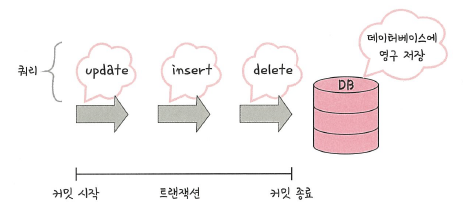

# 4.데이터베이스

## 4.3 트랜잭션과 무결성

### 4.3.1 트랜잭션 (Transaction)

트랜잭션은 **데이터베이스에서 하나의 논리적 기능을 수행하기 위한 작업의 단위**다.  
여러 SQL을 하나로 묶어 **모두 성공(Commit)** 하거나 **전부 취소(Rollback)** 한다.

### ACID 특성 요약

| 약어 | 한글 | 핵심 정의 | 참고 |
|---|---|---|---|
| A | 원자성(Atomicity) | 트랜잭션은 **전부 또는 전무** | 부분성공 불가, 실패 시 전체 롤백 |
| C | 일관성(Consistency) | 제약/규칙을 지킨 **유효한 상태** 유지 | FK/PK/체크 제약 위반 시 커밋 불가 |
| I | 격리성(Isolation) | 동시에 실행돼도 **서로 간섭 없음** | 격리수준별 현상 차이 설명 |
| D | 지속성(Durability) | 커밋된 결과는 **영구 반영** | WAL/저널링/체크섬으로 복구 가능 |

 

### 원자성 (Atomicity) — All or Nothing

ex) 홍철 → 규영 (500만 원 이체)

1) 홍철 잔고 조회  
2) 홍철 500만 원 차감  
3) 규영 500만 원 가산

어느 단계에서든 오류가 나면 **전 과정 롤백**되어 홍철 1000만/규영 0원으로 **완전 복구**되어야 한다.  
-> 트랜잭션 내의 작업들은 모두 하나의 단위로 커밋 또는 롤백되어야 한다.

 

### 커밋과 롤백

- **Commit**: DML(INSERT/UPDATE/DELETE) 이후 명시적 저장 시 변경사항이 **영구 저장**됨  
- **Rollback**: 오류, 예외, Deadlock 등 트랜잭션 불일치 상황 발생 시 자동 또는 수동으로 트랜잭션 시작 시점으로 **전부 되돌림**

 

**커밋(Commit) 예시**

  
모든 쿼리(`update → insert → delete`)가 정상 완료되어 DB에 영구 반영

**롤백(Rollback) 예시**

  
실행 중 오류 발생 시 트랜잭션 전체가 시작 시점으로 되돌아감

 

### 트랜잭션 전파 (Spring)

`@Transactional`을 사용하면 여러 DAO/Repository 호출을 **하나의 트랜잭션 경계**로 묶을 수 있다.

~~~java
@Service
@Transactional(readOnly = true)
public class MemberService {
    private final MemberRepository memberRepository;
    public MemberService(MemberRepository memberRepository) {
        this.memberRepository = memberRepository;
    }
}
~~~

- **읽기 전용 쿼리**는 `readOnly=true`로 JPA의 Dirty Checking 최적화에 도움.  
- 저장/변경 로직은 별도의 서비스 메서드에서 `readOnly=false(기본)`로 분리.  

 

### ➕ Propagation(전파 레벨)

| 속성 | 설명 |
|------|------|
| REQUIRED (기본) | 기존 트랜잭션 있으면 참여, 없으면 새로 시작 |
| REQUIRES_NEW | 기존 트랜잭션 무시하고 무조건 새로 시작 |
| NESTED | 상위 트랜잭션 내부에서 부분 커밋/롤백 가능 |
| MANDATORY | 반드시 트랜잭션 내에서만 실행, 아니면 예외 |
| SUPPORTS | 트랜잭션 있으면 참여, 없어도 그냥 실행 |
| NOT_SUPPORTED | 트랜잭션을 중단시키고 실행 |
| NEVER | 트랜잭션 내 실행 시 예외 발생 |

**@Transactional 주의점**
- 같은 클래스 내부 메서드 간 호출은 AOP 프록시를 우회하므로 트랜잭션이 적용되지 않음.  
- 기본적으로 **Unchecked(Runtime)** 예외만 롤백됨.  
  → 필요 시 `@Transactional(rollbackFor = Exception.class)` 명시.
- Propagation.REQUIRES_NEW는 메인 트랜잭션과 독립적으로 실행.

 

### 일관성 (Consistency)

**허용된 방식으로만 데이터를 변경해야 한다.**  
즉, **모든 트랜잭션은 데이터베이스 제약 조건을 위반하지 않는 상태로 시작하고 종료**해야 한다.

- 예: 잔액 음수 불가, 생년월일 형식 위반 불가, FK 고아 레코드 불가  
- 제약조건(Primary Key/Unique/Not Null/Check/Foreign Key 등)을 **항상 만족**해야 한다.  
- 시스템적으로는 데이터베이스(DBMS)가 보장하지만, 비즈니스 규칙 수준의 일관성은 애플리케이션이 함께 책임 진다.  

 

### 격리성 (Isolation)과 격리 수준

동시 트랜잭션 간 **중간 결과 간섭**을 차단한다. 격리수준이 높을수록 정합성↑ 성능↓

| 수준 | 설명 | 발생 가능한 이상 현상 |
|---|---|---|
| SERIALIZABLE | 사실상 순차 실행 | (없음) 가장 안전/가장 느림 |
| REPEATABLE READ | 같은 행 재조회 결과 동일 | **팬텀 리드** 가능 |
| READ COMMITTED | 커밋된 것만 조회 | **반복 불가능 조회** 가능 |
| READ UNCOMMITTED | 커밋 전 데이터도 조회 | **더티 리드** 가능 |

- **더티 리드(Dirty Read)**: B가 A의 **미커밋 값**을 읽음  
- **반복 불가능 조회(Non-repeatable Read)**: 같은 행을 두 번 읽을 때 값이 다름 (사이에 누군가 수정)  
- **팬텀 리드(Phantom Read)**: 같은 조건으로 재조회 시 **행 수**가 달라짐 (사이에 누군가 INSERT/DELETE)

실무 기본값: **READ COMMITTED** (PostgreSQL/Oracle 기본).  
MySQL InnoDB의 기본은 **REPEATABLE READ** (Next-Key Lock으로 팬텀 완화).

 

### ➕ 트랜잭션 vs 락(lock)

| 구분 | 트랜잭션 | 락(Lock) |
|------|------------|-----------|
| 개념 | 논리적 작업 단위 | 물리적 동시성 제어 수단 |
| 역할 | ACID 보장 | 자원 접근 순서 제어 |
| 관계 | Isolation 보장을 위한 상위 개념 | Isolation을 구현하는 하위 수단 |

트랜잭션은 논리적 단위, 락은 그 중 **격리성(Isolation)** 을 물리적으로 보장하는 도구.

 

### ➕ MVCC & Lost Update

**MVCC(Multi-Version Concurrency Control)**  
- 데이터를 덮어쓰지 않고 **버전별로 관리**  
- 트랜잭션 시작 시점 snapshot을 읽어 **다른 트랜잭션의 미커밋 데이터는 보이지 않음**  
- Undo Log를 통해 과거 버전 데이터 읽기 가능  

MVCC는 격리성과 동시성을 동시에 높이는 방식.

**Lost Update (갱신 손실)**  
T1: SELECT balance=100  
T2: SELECT balance=100  
T1: UPDATE balance=balance-10  
T2: UPDATE balance=balance-20  

→ 최종 balance = 80, T1의 변경이 사라짐

해결책
- Optimistic Lock: `@Version` 필드 비교  
- Pessimistic Lock: `SELECT ... FOR UPDATE`

 

### 지속성 (Durability)

커밋된 변경은 **전원 장애/크래시** 이후에도 살아있어야 한다.

- **WAL(Write-Ahead Logging)** / 저널링: 변경 전 로그 기록 후 적용  
- **체크섬/리두 로그**: 손상 검출/재적용으로 복구  
- 스토리지 **fsync 보증**과 DB 복구 절차로 내구성 확보  
- PostgreSQL은 WAL, MySQL은 redo log를 이용해 Crash Recovery를 수행한다.

---

### 4.3.2 무결성 (Integrity)

무결성은 데이터의 **정확성·일관성·유효성**을 보장해 **신뢰 가능한 상태**를 유지하는 것.

### 무결성 종류

| 종류 | 설명 | 예시 제약 |
|---|---|---|
| 개체 무결성 | 기본키는 NULL/중복 불가 | `PRIMARY KEY(id)` |
| 참조 무결성 | 외래키는 참조 대상 키와 일치 | `FOREIGN KEY(member_id) REFERENCES member(id)` |
| 도메인 무결성 | 속성 값은 정해진 **범위/형식**만 허용 | `CHECK (age BETWEEN 0 AND 120)` |
| NULL 무결성 | 허용되지 않으면 반드시 값 존재 | `name NOT NULL` |

### SQL 예시

~~~sql
-- 개체 무결성
CREATE TABLE member (
  id   BIGINT PRIMARY KEY,
  name VARCHAR(50) NOT NULL,
  age  INT
);

-- 참조 무결성
CREATE TABLE orders (
  order_id  BIGINT PRIMARY KEY,
  member_id BIGINT NOT NULL,
  FOREIGN KEY (member_id) REFERENCES member(id)
);

-- 도메인 무결성
ALTER TABLE member
  ADD CONSTRAINT chk_age CHECK (age BETWEEN 0 AND 120);
~~~

💡TIP   
- FK에 **ON DELETE/UPDATE CASCADE/RESTRICT/SET NULL** 정책을 명확히.  
- 애플리케이션 유효성 검증과 **DB 제약**은 **둘 다** 둔다. (이중 안전망)  
- 배치/마이그레이션 시 제약 위반 탐지용 **검증 쿼리**를 선적용.

 

### ➕ 무결성 확장 개념

| 구분 | 설명 | 예시 |
|------|------|------|
| 논리적 무결성 | FK/PK/Check 등 구조적 제약 | DB 스키마 차원 |
| 업무 무결성 | 비즈니스 로직 제약 | 잔액 < 0 불가, 상태 전이 규칙 |
| 데이터 품질 무결성 | 데이터 형식·규칙 준수 | 이메일/전화번호 형식 |