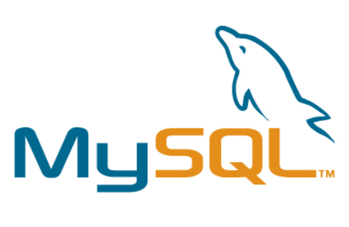
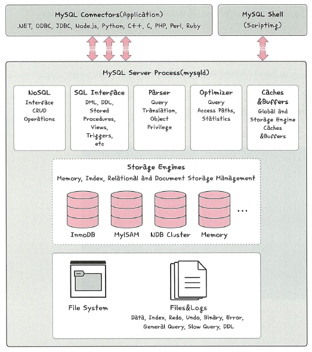
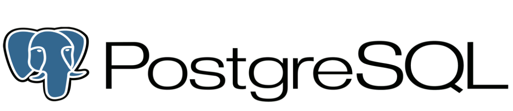
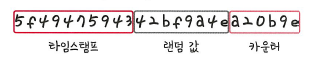
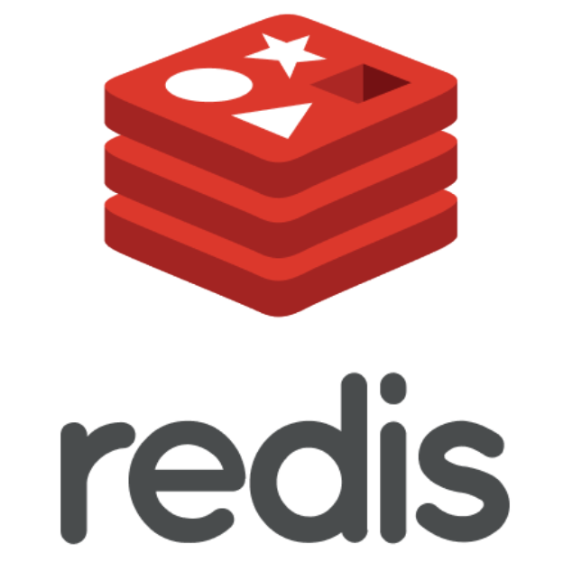
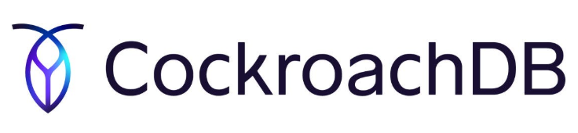

# 4. 데이터베이스

## 4.4 데이터베이스의 종류

### 4.4.1 관계형 데이터베이스 (RDBMS)

관계형 데이터베이스(RDBMS, Relational Database Management System)는  
**행(Row)** 과 **열(Column)** 로 구성된 **테이블 형태의 데이터**를 저장하며,  
이를 조작하기 위해 **SQL(Structured Query Language)** 을 사용한다.  

대표적인 관계형 데이터베이스로는  
**MySQL, PostgreSQL, Oracle, SQL Server, MariaDB** 등이 있다.

- 표준 SQL을 따르지만, 제품별로 **방언(Dialect)** 차이가 있음  
  - Oracle: PL/SQL  
  - SQL Server: T-SQL  
  - MySQL: SQL  

 

### MySQL

MySQL은 오픈소스 관계형 데이터베이스로,  
대부분의 **운영체제와 호환**되며 전 세계적으로 가장 널리 사용된다.

- **스택오버플로(2021) 기준 1위 DBMS**
  - MySQL: 50.18%  
  - PostgreSQL: 40.42%  
  - SQLite, MongoDB, SQL Server 순  

### ➕ MySQL 특징
- C, C++로 개발된 고성능 RDBMS  
- **MyISAM 인덱스 압축 기술**, **B-트리 기반 인덱스**  
- **최대 64개 인덱스**, **메모리 합창 시스템**, **빠른 조인 처리**  
- **InnoDB 엔진 기반의 트랜잭션, Foreign Key, WAL(redo log)** 지원  
- **Replication(복제)**, **Sharding(분산)** 기능으로 대규모 서비스 지원  

 

#### MySQL 스토리지 엔진 아키텍처

| 구성 요소 | 설명 |
|------------|------|
| **SQL Interface** | DDL/DML/Stored Procedure/Trigger 등 SQL 명령 처리 |
| **Parser** | SQL 문법 검사 및 객체 권한 확인 |
| **Optimizer** | 실행 계획 수립 및 쿼리 최적화 |
| **Caches & Buffers** | 쿼리 결과 및 엔진 캐시 관리 |
| **Storage Engine** | InnoDB, MyISAM 등 데이터 저장 엔진 |
| **File System / Logs** | 데이터, 인덱스, 리두/언두 로그 관리 |

### ➕ MySQL 추가 정보
MySQL은 **스토리지 엔진 구조가 모듈화**되어 있어,  
필요 시 InnoDB ↔ MyISAM 등 엔진 교체가 가능하다.  
트랜잭션, Foreign Key, Crash Recovery가 필요한 경우 **InnoDB** 사용을 권장한다.

### ➕ 쿼리 캐시 (Query Cache)
- 입력된 SQL문과 결과를 **캐시에 저장**  
- 동일한 쿼리 재실행 시, **서버 연산 없이 캐시 결과 반환**  
- 단순 SELECT 쿼리에 적합  
- 단, 데이터 변경이 많을 경우 캐시 무효화로 오히려 성능 저하 가능

 

### PostgreSQL

PostgreSQL은 **MySQL 다음으로 개발자들이 선호하는** 오픈소스 관계형 데이터베이스다.  
객체-관계형 DB(Object-Relational DB)로 불리며, **확장성**과 **표준 SQL 호환성**이 높다.

#### 주요 특징
- **VACUUM 기능**: 디스크 공간 회수 및 재사용  
- **32TB 테이블 크기 지원**  
- **JSON 지원**: SQL + NoSQL 형태의 하이브리드 접근 가능  
- **트랜잭션 로그, 접근 제어, 복구 기능 내장**  
- **MVCC(Multi-Version Concurrency Control)** 로 동시성 보장  
- 고급 기능: 뷰, 트리거, CTE, 윈도우 함수, 확장 모듈(PostGIS 등)

> 💡 **추가 정보**  
> PostgreSQL은 **엄격한 ACID 보장 + 고급 SQL 기능** 덕분에  
> **금융, 공공기관, AI 분석 플랫폼** 등에서도 활발히 사용된다.

---

### 4.4.2 NoSQL 데이터베이스

NoSQL(Not Only SQL)은  
관계형 모델을 벗어나 **비정형·반정형 데이터**를 유연하게 저장하는 데이터베이스다.

- 스키마가 고정되지 않음 (Schema-less)  
- 수평 확장성(Scale-out) 우수  
- JSON/BSON 기반의 **문서형(Document)** DB가 대표적  
- 대표 제품: **MongoDB**, **Redis**, **Cassandra**, **DynamoDB**

 

### MongoDB

MongoDB는 **JSON(BSON)** 형식으로 데이터를 저장하는 **문서 지향 데이터베이스**다.  
스키마를 미리 정의하지 않아 **유연한 구조**를 가지며,  
**확장성·고가용성·분산 처리 성능**이 우수하다.

#### 주요 특징
- **BSON(Binary JSON)** 기반으로 복잡한 구조도 저장 가능  
- **Replica Set**, **Sharding** 기능으로 대규모 분산처리 지원  
- **스키마 자유도**가 높아 도메인 변경 시 유연  
- **컬렉션(Collection)** 단위로 데이터 관리  
- 각 문서는 자동으로 **ObjectID**(타임스탬프 + 랜덤값 + 카운터) 부여  

#### MongoDB ObjectID 구성  
MongoDB에서 각 문서는 고유한 ObjectID를 가진다.  
그 구조는 아래와 같다.  

| 구성 요소 | 설명 |
|------------|------|
| 타임스탬프(4B) | 생성 시간 |
| 랜덤값(5B) | 머신 ID/프로세스 ID |
| 카운터(3B) | 순차 증가 값 |

> 💡 **추가 정보**  
> MongoDB는 스키마가 없기 때문에 **정규화 대신 중첩 구조(Embed)** 를 사용한다.  
> 예: 주문 내역 안에 고객 정보/상품 리스트 포함 → 조인 없이 빠른 조회 가능.

 

### Redis

Redis는 **인메모리 기반의 Key-Value 데이터베이스**로,  
**빠른 응답 속도**가 필요한 **캐시·세션·실시간 서비스**에 주로 사용된다.

#### 주요 특징
- 기본 자료형: **String**, 최대 512MB 저장 가능  
- 지원 자료구조: **Set, List, Sorted Set, Hash**  
- **pub/sub** 기능으로 실시간 메시징 가능  
- **Persistence(영속화)** 기능: AOF(Append Only File) 또는 RDB 스냅샷 저장  
- **TTL(Time To Live)** 로 자동 만료 설정 가능  

| 항목 | 설명 |
|------|------|
| 데이터 구조 | 문자열, 해시, 리스트, 집합, 정렬된 집합 |
| 주요 용도 | 캐시, 세션, 순위표, 실시간 피드, 메시징 큐 |
| 영속화 | AOF(Log Append) / RDB(Snapshot) 방식 |
| 동시성 | 단일 스레드 기반으로 Race Condition 방지 |

> 💡 **추가 정보**  
> Redis는 CPU 대신 **메모리 I/O에 최적화**되어 있어  
> 일반 디스크 기반 DB보다 **수백 배 빠른 응답 속도**를 제공한다.

---

### ➕ NewSQL

NewSQL은 **RDBMS의 트랜잭션 안정성(ACID)** 과  
**NoSQL의 수평 확장성(Scalability)** 을 모두 만족시키기 위해 등장한 신개념 DBMS이다.

| 구분 | RDBMS | NoSQL | NewSQL |
|------|--------|--------|--------|
| 데이터 모델 | 테이블(정형) | 문서·키값(비정형) | 테이블(정형) |
| 트랜잭션 | 완전한 ACID 보장 | Eventual Consistency | 완전한 ACID 보장 |
| 확장성 | Scale-Up 중심 | Scale-Out 중심 | Scale-Out 중심 |
| 쿼리 언어 | SQL | 전용 API | SQL |
| 대표 제품 | MySQL, PostgreSQL | MongoDB, Redis | **CockroachDB, VoltDB, Google Spanner** |

#### 특징 요약
- SQL 기반이지만, **분산 환경에서도 트랜잭션 보장**  
- 분산 합의 알고리즘(Paxos, Raft)을 이용해 **데이터 정합성 확보**  
- 클러스터 노드 간 **자동 샤딩/복제/Failover** 지원  
- 클라우드 네이티브 구조에 최적화됨  

💡TIP   
대규모 트래픽에서 RDBMS의 확장성 한계를 극복하고자 할 때,  
**Spanner**(Google Cloud), **TiDB**(PingCAP), **CockroachDB**(Go 기반) 같은  
NewSQL 솔루션이 활용된다.

 

### ➕ 관계형 vs NoSQL vs NewSQL 비교

| 항목 | RDBMS | NoSQL | NewSQL |
|------|--------|--------|--------|
| 데이터 구조 | 행(Row)·열(Column) | 문서·키-값·그래프 등 비정형 | 행(Row)·열(Column) |
| 스키마 | 고정형 (정의 필요) | 자유형 (동적 스키마) | 고정형 |
| 트랜잭션 | ACID 보장 | Eventual Consistency | 완전한 ACID |
| 확장성 | 수직 확장 (Scale-Up) | 수평 확장 (Scale-Out) | 수평 확장 (Scale-Out) |
| 성능 지향 | 정합성 우선 | 성능·가용성 우선 | 둘 다 균형 |
| 쿼리 언어 | SQL | 전용 API/쿼리 | SQL |
| 대표 제품 | Oracle, MySQL, PostgreSQL | MongoDB, Redis, Cassandra | TiDB, Spanner, CockroachDB |
| 주요 활용 | 트랜잭션 중심 시스템 (금융, ERP) | 로그, 세션, 캐시, 빅데이터 | 대규모 분산 트랜잭션 환경 |

- **RDBMS** &nbsp;→ 데이터 정확성과 일관성이 중요한 시스템  
- **NoSQL** &nbsp; → 대용량, 비정형, 실시간 성능이 필요한 시스템  
- **NewSQL** → 그 둘을 융합한 차세대 분산 트랜잭션 DBMS