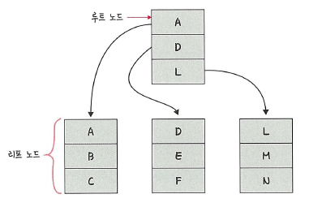
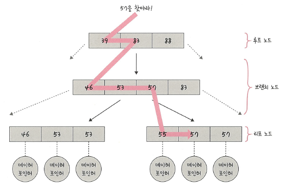

# 4.데이터베이스
## 4.5 인덱스(Index)와 데이터베이스 객체 구조
### 4.5.1 인덱스의 필요성

인덱스(Index)는 **데이터를 빠르게 찾는 장치**이다.  
책의 마지막 장에 있는 ‘찾아보기(Index)’처럼, 테이블 안의 특정 데이터를  
한 번에 찾아갈 수 있도록 도와준다.

  

> 책의 본문 안에서 ‘다윈’을 찾으려면 전체를 훑어야 하지만,  
> 찾아보기가 있으면 ‘다윈 → 76쪽’으로 즉시 이동할 수 있다.  
> 데이터베이스의 인덱스도 같은 역할을 한다.

---

### 4.5.2 인덱스의 구조 — B-트리(B-Tree)

인덱스는 보통 **B-트리(Balanced Tree)** 구조로 만들어진다.  
루트 노드 → 브랜치 노드 → 리프 노드로 구성되어 있으며,  
정렬 상태를 유지한 채로 **탐색 효율을 logN 수준**으로 유지한다.

  

**탐색 예시**
- 루트에서 키 값 비교 후 경로 결정  
- 브랜치 노드를 따라 리프 노드 도달 → 실제 데이터 접근  
- 데이터가 100만 건이라도 트리 깊이 10단계면 탐색 가능  

> B-트리의 장점: “균형 유지 + 빠른 탐색 + 효율적인 범위 검색”

 

#### 인덱스의 효율성과 대수확장성(Logarithmic Scalability)

| 트리 깊이 | 인덱스 항목 수 |
|------------|----------------|
| 3 | 64 |
| 5 | 1,024 |
| 7 | 16,384 |
| 10 | 1,048,576 |

> 인덱스는 데이터 양이 늘어도 탐색 단계가 로그(logN) 수준으로만 증가한다.  
> 즉, **효율적이며 확장 가능한 검색 구조**이다.

 

➕ **B-트리와 B+트리의 차이**
- **B-트리**는 리프 노드와 내부 노드 모두에 키와 데이터가 존재  
- **B+트리**는 리프 노드에만 실제 데이터가 존재하고, 내부 노드는 키만 유지  
- MySQL의 InnoDB는 **B+트리 구조**를 사용해 리프 노드 간 순차 탐색이 가능  
→ 범위 검색(예: `WHERE age BETWEEN 20 AND 30`)에 효율적이다.

---

### 4.5.3 인덱스 만드는 방법

#### MySQL

MySQL은 **클러스터형 인덱스(Clustered Index)** 와  
**세컨더리 인덱스(Secondary Index)** 를 모두 지원한다.

| 구분 | 설명 |
|------|------|
| 클러스터형 인덱스 | 실제 데이터가 인덱스와 함께 정렬되어 저장됨 (PK 기반) |
| 세컨더리 인덱스 | 인덱스만 별도로 존재, 실제 데이터는 테이블에 저장 |

**예시 (SQL)**  
`CREATE INDEX idx_user_age ON users(age);`

- PK 외에도 보조 인덱스를 추가로 생성 가능  
- unique, not null 속성을 통해 제약조건과 함께 성능 향상  
- 단, 인덱스가 많을수록 **데이터 수정 시 오버헤드** 발생  

➕ **InnoDB vs MyISAM**
- InnoDB: 트랜잭션, Foreign Key, WAL(redo log) 지원  
- MyISAM: 인덱스 압축, 빠른 읽기 성능 / 트랜잭션 미지원  

 

➕ **InnoDB 인덱스 구조**
- 클러스터형 인덱스는 **PK 기준으로 B+트리 정렬**  
- 세컨더리 인덱스는 **리프 노드가 PK를 참조** (즉, 두 번 접근해야 함)  
- PK를 잘못 설정하면 데이터 재배치로 INSERT 성능 저하 발생 가능  

 

➕ **실행계획(Execution Plan) 분석**
- `EXPLAIN SELECT ...` 로 인덱스 사용 여부 확인  
- `type=ALL` → 전체 스캔 (비효율), `type=range` / `ref` → 인덱스 사용  
- `key`, `rows`, `possible_keys` 등의 항목을 통해 쿼리 최적화 가능  

 

#### MongoDB

MongoDB는 **ObjectID**를 기본 인덱스로 자동 생성한다.  
필요 시 복합 인덱스(Compound Index)를 직접 지정할 수 있다.

**예시 (MongoDB)**  
`db.collection.createIndex({ name: 1, age: -1 })`

- 1: 오름차순, -1: 내림차순  
- 필드 순서에 따라 성능 차이가 발생 (정렬, 범위 검색 시 주의)  
- BSON(Binary JSON) 기반 B-트리 구조로 인덱싱 수행  

 

➕ **MongoDB 인덱스 심화**
- **Multikey Index**: 배열 요소 각각에 인덱스를 생성  
- **Text Index**: 문자열 검색 (`$text`, `$search`)에 사용  
- **TTL Index**: 특정 시간이 지나면 자동 삭제되는 시한 인덱스  
- `explain()` 명령으로 인덱스 사용 여부 및 효율 분석 가능  

---

### 4.5.4 인덱스 최적화 기법

#### 1️⃣ 인덱스는 비용이다
- 검색은 빨라지지만, **INSERT/UPDATE/DELETE 시 인덱스도 갱신**해야 함  
- 인덱스가 많을수록 쓰기 성능 저하  
- 조회가 잦은 컬럼에만 인덱스를 설정하는 것이 효율적이다  

 

#### 2️⃣ 항상 테스트하라
- 인덱스 효율은 **데이터 양·쿼리 패턴·서비스 구조**에 따라 다르다  
- MySQL에서는 EXPLAIN 명령으로 실행 계획을 점검해야 한다  

**예시**
`EXPLAIN SELECT * FROM user WHERE age > 30;`

 

#### 3️⃣ 복합 인덱스의 순서
복합 인덱스는 **같음 → 정렬 → 범위 → 카디널리티(중복도)** 순으로 만들어야 한다.

| 우선순위 | 기준 | 예시 |
|-----------|------|------|
| ① | =, IN 조건 | WHERE email='a@b.com' |
| ② | 정렬 기준 | ORDER BY created_at |
| ③ | 범위 조건 | WHERE age > 30 |
| ④ | 중복도 낮은 컬럼 | email(고유값 많음) > gender(값 적음) |

 

➕ **인덱스 비활성화 예시**
| 상황 | 이유 |
|------|------|
| `LIKE '%abc'` | 앞에 와일드카드 있으면 인덱스 무시 |
| `OR` 조건 | 두 컬럼 모두 인덱스 있어야만 적용 가능 |
| `함수 적용` | `WHERE DATE(created_at)`은 인덱스 무효 |
| `타입 불일치` | `int` vs `varchar` 비교 시 인덱스 사용 안 함 |

 

➕ **인덱스 힌트 (Index Hint)**
- 옵티마이저가 잘못된 인덱스를 선택할 때 명시적으로 지정 가능  
`SELECT * FROM user USE INDEX (idx_user_age) WHERE age > 20;`

 

### ➕ 인덱스 설계 시 고려사항

| 항목 | 설명 |
|------|------|
| Covering Index | 쿼리에서 필요한 모든 컬럼이 인덱스에 포함되어 테이블 접근 불필요 |
| Partial Index | 특정 조건을 만족하는 행만 인덱싱 (PostgreSQL 등) |
| Hash Index | 정확한 일치 검색에 강함, 범위 검색엔 부적합 |
| Composite Index | 여러 컬럼을 묶어 인덱싱 |
| Clustered vs Non-Clustered | 실제 데이터와 인덱스 정렬 일치 여부 |
| Cardinality(카디널리티) | 고유값이 많을수록 인덱스 효율 높음 |

 

➕ **인덱스 최적화 포인트**
- 자주 사용되는 쿼리의 **WHERE / JOIN / ORDER BY 컬럼** 위주로 인덱싱  
- **읽기 vs 쓰기 비율** 고려: 읽기 많은 테이블에 인덱스 집중  
- **통계 정보 갱신** (`ANALYZE TABLE`)으로 옵티마이저 판단 정확도 향상  
- **Query Cache + Index 병행** 시 응답 시간 극대화 가능  

 

### ➕ 테이블스페이스 (Tablespace)

**테이블스페이스**는 데이터베이스 객체를 저장하는 **논리적 공간**이다.

- 실제 데이터를 저장하는 물리 파일(Datafile)을 관리하는 논리 단위  
- 하나 이상의 데이터 파일로 구성  
- 테이블, 인덱스, 뷰 등의 **구조 및 데이터 저장소 역할**을 한다  

> 테이블스페이스는 “물리적 저장소와 논리적 데이터 구조를 연결하는 계층”이다.  
> DB 성능과 확장성을 결정하는 핵심 단위이다.

 

➕ **테이블스페이스 설계 포인트**
- I/O 병목 방지를 위해 **데이터와 인덱스를 별도 테이블스페이스로 분리**  
- 대규모 시스템은 **Tablespace별 백업 및 복구 단위**로 관리  
- Oracle에서는 `ALTER DATABASE DATAFILE ...` 명령으로 크기 조절 가능  

 

### ➕ 스키마 (Schema)

스키마는 **데이터베이스 객체들의 논리적 집합**이다.  
테이블, 뷰, 인덱스, 시퀀스 등 모든 객체가 포함된다.

- 각 스키마는 특정 사용자(USER)에 의해 소유된다  
- 하나의 사용자가 여러 객체를 생성하면 모두 해당 스키마에 속한다  
- “데이터베이스의 논리적 폴더 구조”와 유사한 개념이다  

> 스키마는 논리 구조를 정의하고,  
> 테이블스페이스는 물리적 저장 공간을 담당한다.  

- **MySQL:** 스키마 = 데이터베이스  
- **Oracle:** 하나의 DB 내 여러 스키마 존재 (User=Schema 구조)  
- 서비스별, 고객별로 스키마를 분리하면 **보안·관리성·확장성 향상**  
- 협업 시 **네임스페이스 충돌 방지**에 유용  

 

### ➕ 스키마 객체 종류 비교

| 구분 | MySQL | Oracle |
|------|--------|--------|
| Sequence | 별도 제공 X (테이블로 생성) | 별도 제공 O |
| View | CREATE VIEW ... AS SELECT ... | 동일 |
| Constraint | NOT NULL, UNIQUE, PRIMARY KEY 등 | 동일 |
| Index | CREATE INDEX idx ON table(col) | 동일 |
| Synonym | CREATE SYNONYM ... | PUBLIC/PRIVATE 둘 다 지원 |

 

### ➕ 스키마 권한부여 (ROLE)

| 구분 | 설명 |
|------|------|
| DBA | 최고 관리자 |
| ROLE | 여러 권한 묶음 |
| USER | 실제 사용자 |  

- ROLE을 사용하면 여러 권한을 묶어 일괄 부여 및 회수 가능하다  
- DBA가 ROLE을 생성하고 사용자에 권한을 위임한다  

 

### ➕ 추가 정보

| 주제 | 설명 |
|------|------|
| Materialized View | 실제 데이터를 저장해 조회 속도를 높인 뷰 |
| Schema vs Database | MySQL은 거의 동일 / Oracle은 DB 내 여러 Schema 존재 |
| View vs Index | 뷰는 논리적 조회 구조, 인덱스는 물리적 검색 가속 구조 |
| Optimizer | 실행계획(Execution Plan)을 기반으로 최적 인덱스 선택 |
| Explain Plan | 쿼리 성능 분석 및 인덱스 튜닝 핵심 도구 |

 

### ➕ 뷰 (View)
뷰(View)는 하나 이상의 테이블을 기반으로 만들어지는 **가상 테이블**이다.  
복잡한 쿼리를 단순화하고, **민감정보를 숨길 수 있는 추상화 계층** 역할을 한다.

- 뷰는 데이터를 직접 저장하지 않고, SELECT 결과를 테이블처럼 보여준다.  
- **접근 제어, 권한 분리, 재사용성 향상**에 유용하다.

 

### ➕ 일반 뷰 vs Materialized View

- **일반 뷰(View)**  
  항상 원본 테이블을 조회하므로 실시간성은 높지만, 쿼리가 복잡하면 느릴 수 있다.

- **Materialized View**  
  조회 결과를 실제로 저장해 두므로, 읽기는 매우 빠르지만 갱신(리프레시)이 필요하다.  
  예: 대시보드용 통계, 리포트성 집계 데이터

 

### ➕ 업데이트 가능한 뷰 (Updatable View)

- 단순 SELECT 기반이면 **INSERT/UPDATE/DELETE 가능**  
- `JOIN`, `GROUP BY`, `DISTINCT` 포함 시 **갱신 불가**

 

### ➕ 뷰와 인덱스 관계

- 일반 뷰는 데이터를 따로 저장하지 않으므로 **인덱스를 직접 생성할 수 없다.**  
- Materialized View는 실제 테이블처럼 저장되므로 **인덱스 생성이 가능하다.**  
- 분석/리포트 쿼리에서는 **“Materialized View + 인덱스” 조합**이 매우 강력하다.

 

### ➕ 뷰와 스키마 관계

- 스키마는 논리적 영역이기 때문에, 뷰도 스키마 단위로 소속된다.  
- 예를 들어 “보고용 스키마(read_only)”를 따로 두면,  
  운영 테이블에는 직접 접근하지 않고 **필요한 데이터만 안전하게 노출**할 수 있다.  

---

### 📌 핵심 요약

1. 인덱스  
   - 인덱스는 데이터를 빠르게 찾기 위한 지도이다.  
   - B-트리/B+트리 구조 덕분에 log N 수준의 탐색 효율을 유지한다.  
   - 인덱스가 많아질수록 쓰기 비용이 커지므로, 자주 조회되는 컬럼 위주로 전략적으로 설계해야 한다.  
   - 복합 인덱스는 “일치 조건 → 정렬 기준 → 범위 조건” 순서로 만드는 것이 효율적이며, LIKE '%abc'나 컬럼에 함수를 적용하는 조건은 인덱스를 무력화시킬 수 있다.  
   - MySQL은 클러스터형·세컨더리 인덱스 구조와 EXPLAIN 기반 튜닝이 핵심이다.  
   - MongoDB는 `_id` 인덱스 외에도 Multikey, TTL, Text 인덱스 등 문서 지향 특화 인덱스를 제공한다.  

2. 테이블스페이스  
   - 테이블스페이스는 실제 데이터를 담는 물리 파일을 논리적으로 묶은 단위이다.  
   - 데이터와 인덱스를 분리해 I/O 병목을 줄이고, 백업·복구 범위를 세분화할 수 있다.  

3. 스키마  
   - 스키마는 테이블, 인덱스, 뷰 등 객체를 논리적으로 묶은 폴더와 같은 개념이다.  
   - MySQL은 “스키마 = 데이터베이스”로 사용되고, Oracle은 한 DB 안에 여러 스키마가 공존한다.  
   - 고객별·서비스별로 스키마를 분리하면 보안성과 관리 효율이 높아진다.  
   - ROLE은 여러 권한을 묶어 사용자에게 일괄적으로 부여·회수하는 권한 관리 단위이다.  

4. 뷰  
   - 뷰는 복잡한 SELECT를 캡슐화한 가상 테이블이다.  
   - 민감한 컬럼을 숨기고 필요한 데이터만 노출할 수 있어 보안 계층으로 활용된다.  
   - Materialized View는 결과를 물리적으로 저장해 조회 성능을 극대화하며, 인덱스도 적용 가능하다.  
   - 단, 뷰를 중첩해 사용하면 성능 저하가 발생할 수 있으므로 항상 `EXPLAIN`으로 실행 비용을 확인해야 한다.