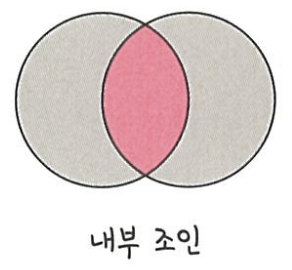
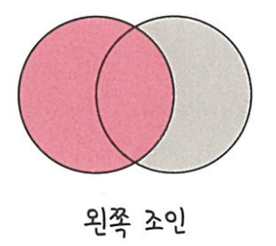
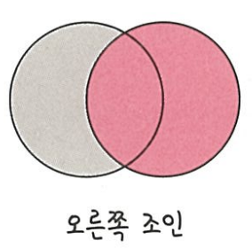
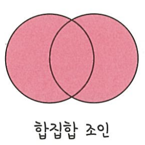

# 4.데이터베이스
## 4.6 조인의 종류

조인(Join)
- **두개 이상의 테이블**을 묶어서 하나의 결과물을 만드는 것
- 종류 : 내부 조인, 왼쪽 조인, 오른쪽 조인, 합집합 조인
- 쿼리 작성 시 : MySQL(Join), MongoDB(lookup)
  - MongoDB에서 lookup 사용 지향 -> 조인 작업이 많은경우 RDBMS 사용 필요
- SQL Join 시각화 사이트 : https://sql-joins.leopard.in.ua/

*정리
<table style="border: 2px; text-align: center">
  <tr>
    <th> </th>
    <th> 내부 조인 </th>
    <th> 왼쪽 조인 </th>
    <th> 오른쪽 조인 </th>
    <th> 합집합 조인 </th>
  </tr>
  <tr>
    <th> 이미지 </th>
    <th>  </th>
    <th>  </th>
    <th>  </th>
    <th>  </th>
  </tr>
  <tr>
    <th> 설명 </th>
    <td> 두 테이블의 곂치는 값 </td>
    <td> 왼쪽 테이블의 모든 값 </td>
    <td> 오른쪽 테이블의 모든 값 </td>
    <td> 두 테이블의 모든 값 </td>
  </tr>
  <tr>
    <th> 쿼리 </th>
    <td> 
        SELECT * FROM TableA A
         
        <a style="font-weight: bold">INNER JOIN</a> TableB B ON
         
        A.key = B.key
    </td>
    <td>
        SELECT * FROM TableA A
         
        <a style="font-weight: bold">LEFT JOIN(= LEFT OUTER JOIN)</a> TableB B ON
         
        A.key = B.key
    </td>
    <td>
        SELECT * FROM TableA A
         
        <a style="font-weight: bold">RIGHT JOIN(= RIGHT OUTER JOIN)</a> TableB B ON
         
        A.key = B.key
    </td>
    <td>
        SELECT * FROM TableA A
         
        <a style="font-weight: bold">FULL OUTER JOIN</a> TableB B ON
         
        A.key = B.key
    </td>
  </tr>
</table>