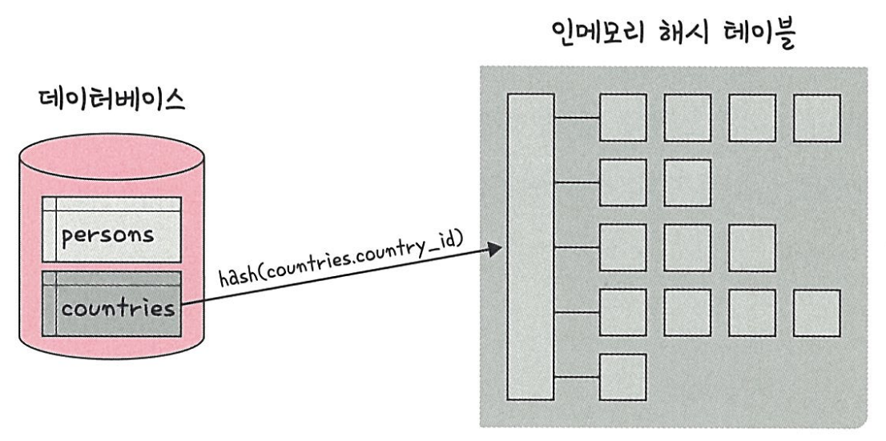
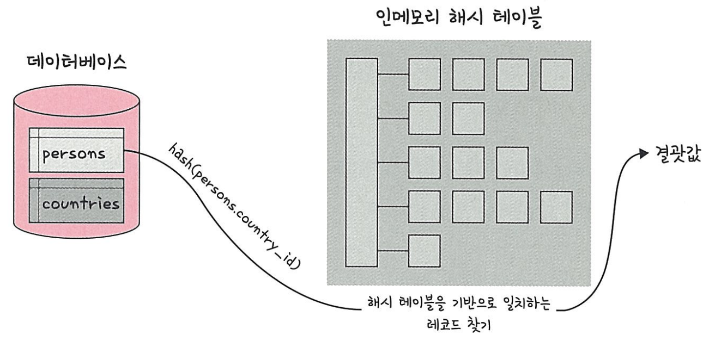

# 4.데이터베이스
## 4.7 조인의 원리
- 조인은 **조인의 원리**를 기반으로 조인 작업이 이루어짐
- 종류 : 중첩 루프 조인, 정렬 병합 조인, 해시 조인

### 4.7.1 중첩 루프 조인
- 중첩 for문과 같은 원리로 조건에 맞을 시 조인 하는 방식
- 랜덤 접근에 대한 비용이 많이 증가됨(대용량의 테이블에서 사용하지 않음)

예시  
A와 B 테이블을 조인
```
코드
for each row in A matching reference key {
    for each row in B matching reference key {
        if row satisfies join conditions, end to client
    }
}
```

첫 번째 테이블에서 행을 한번에 하나씩 읽음 -> 그다음 테이블에서도 행을 하나씩 읽음 -> 조건에 맞는 레코드 발견 -> 결과값 반환

### 4.7.2 정렬 병합 조인
- 각각의 테이블을 조인할 필드 기준으로 정렬 후 조인 하는 방식
- 사용 조건 
  - 조인할 때 쓸 적절한 인덱스가 없을 시
  - 대용량의 테이블을 조인 시
  - 조인 조건으로 범위 비교 연산자(<, > 등)가 있을 시

### 4.7.3 해시 조인
- 해시 테이블을 기반으로 조인하는 방식
- 중첩 루프 조인보다 효율적(두개 테이블을 조인한다고 했을 때 하나의 테이블이 메모리에 온전히 들어갈 때)
- 동등(=) 조인에서만 사용 가능
- MySQl8.0.18에서 사용 가능
- 2가지 단계(빌드 단계, 프로브 단계)로 나뉨


예시  
persons와 countries테이블을 조인

<table style="border: 2px; text-align: center">
  <tr>
    <th> </th>
    <th> 빌드 단계 </th>
    <th> 프로브 단계 </th>
  </tr>
  <tr>
    <th> 이미지 </th>
    <th>  </th>
    <th>  </th>
  </tr>
  <tr>
    <th> 정의 </th>
    <td> 입력 테이블 중 하나를 기반으로 메모리 내 해시 테이블을 빌드 </td>
    <td> 레코드를 읽기 시작 </td>
  </tr>
  <tr>
    <th> 특징 </th>
    <td> 
        둘중 바이트가 더 작은 테이블을 기반으로 빌드
        <br>
        조인에 사용되는 필드가 해시 테이블의 키로 사용됨
    </td>
    <td>
        각 레코드에서 persons.country_id에 일치하는 레코드를 찾아서 결과값으로 반환
        <br>      
        중첩 루프 조인보다 성능이 더 좋음(각 테이블을 한 번씩만 읽음)
        <br>    
        시스템 변수(join_buffer_size)에 의해 사용 가능한 메모리양이 제어됨
        <br>    
        런타임 시 조정 가능
    </td>
  </tr>
</table>