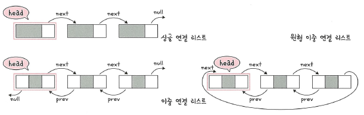
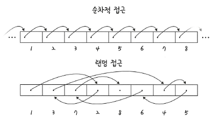
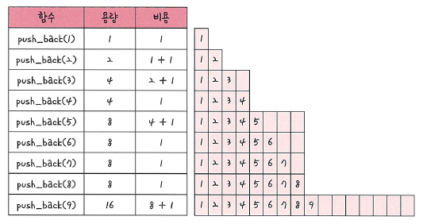
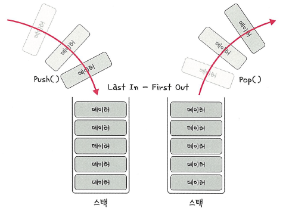
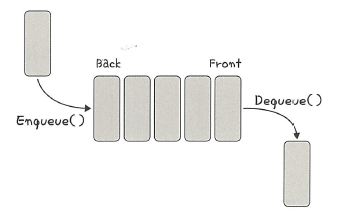

# 5. 자료구조

## 5.2 선형 자료 구조

선형 자료 구조란 **데이터가 일렬로 나열되어 있는 구조**이다.  
대표적으로 배열, 연결 리스트, 벡터(ArrayList), 스택, 큐가 있다.

---

### 5.2.1 연결 리스트 (Linked List)

연결 리스트는 데이터를 **노드(Node)** 단위로 관리하며,  
각 노드는 데이터와 다음 노드를 가리키는 포인터로 구성된다.



- **싱글 연결 리스트**: 한 방향(next)으로만 연결  
- **이중 연결 리스트**: 앞뒤(prev, next) 양방향 연결  
- **원형 연결 리스트**: 마지막 노드가 첫 번째 노드를 가리킴  

**특징**
- 삽입/삭제: O(1)  
- 탐색: O(n)  
- 임의 접근 불가능 (랜덤 접근 X)

```java
import java.util.*;

LinkedList<Integer> list = new LinkedList<>();
list.addLast(10);
list.addFirst(5);
ListIterator<Integer> it = list.listIterator(1);
it.add(7); // 중간 삽입
```

<details>
  <summary><b>연결 리스트 예제</b></summary>

```java
import java.util.*;

public class LinkedListExample {
    public static void main(String[] args) {
        LinkedList<Integer> list = new LinkedList<>();
        list.addLast(10);
        list.addFirst(5);
        ListIterator<Integer> it = list.listIterator(1);
        it.add(7); // 중간 삽입

        System.out.println("연결 리스트 원소: " + list);
    }
}
```

<b>출력 결과</b>
```
연결 리스트 원소: [5, 7, 10]
```
</details>

---

### 5.2.2 배열 (Array)

배열은 **같은 타입의 데이터**를 연속된 메모리 공간에 저장한다.  
정해진 크기를 가지며, **랜덤 접근(random access)** 이 가능하다.



- 접근: O(1)  
- 삽입/삭제: O(n)  
- 순차 접근과 랜덤 접근이 모두 가능  
- 메모리 크기가 고정되어 있음  

```java
int[] arr = new int[5];
arr[0] = 10;
System.out.println(arr[0]);
```

<details>
  <summary><b>배열 예제</b></summary>

```java
public class ArrayExample {
    public static void main(String[] args) {
        int[] arr = new int[5];
        arr[0] = 10;
        arr[1] = 20;
        arr[2] = 30;

        int maxIdx = 0;
        for (int i = 1; i < arr.length; i++) {
            if (arr[i] > arr[maxIdx]) maxIdx = i;
        }

        System.out.println("최대값: " + arr[maxIdx]);
    }
}
```

<b>출력 결과</b>
```
최대값: 30
```
</details>

> 데이터 추가/삭제가 많은 경우 배열보다 연결 리스트가 효율적이다.

---

### 5.2.3 동적 배열 (ArrayList)

ArrayList는 **동적 배열(Dynamic Array)** 로, 크기가 자동으로 조정된다.  
배열과 달리 요소가 추가되면 메모리가 재할당되어 확장된다.



- 뒤에 요소를 추가하는 `add()`은 평균적으로 O(1)  
- 중간 삽입/삭제는 O(n)  
- 랜덤 접근 가능  

```java
import java.util.*;

ArrayList<Integer> list = new ArrayList<>();
list.add(1);
list.add(2);
list.remove(list.size() - 1);
```

<details>
  <summary><b>ArrayList 예제</b></summary>

```java
import java.util.*;

public class ArrayListExample {
    public static void main(String[] args) {
        Scanner sc = new Scanner(System.in);
        ArrayList<Integer> even = new ArrayList<>();

        System.out.println("정수 5개를 입력하세요:");
        for (int i = 0; i < 5; i++) {
            int n = sc.nextInt();
            if (n % 2 == 0) even.add(n);
        }

        System.out.println("짝수 리스트: " + even);
    }
}
```

<b>입력 예시</b>
```
3 6 4 7 8
```

<b>출력 결과</b>
```
짝수 리스트: [6, 4, 8]
```
</details>

> 크기 증가 시 평균(amortized) O(1)의 시간 복잡도를 가진다.

---

### 5.2.4 스택 (Stack)

스택은 **LIFO(Last In First Out)** 구조이다.  
가장 나중에 들어온 데이터가 가장 먼저 나간다.



- 삽입/삭제: O(1)  
- 탐색: O(n)  

```java
import java.util.*;

Deque<Integer> stack = new ArrayDeque<>();
stack.push(1);
stack.push(2);
stack.pop();
```

<details>
  <summary><b>스택 예제</b></summary>

```java
import java.util.*;

public class StackExample {
    public static void main(String[] args) {
        String s = "(())()";
        Deque<Character> stack = new ArrayDeque<>();
        boolean valid = true;

        for (char c : s.toCharArray()) {
            if (c == '(') stack.push(c);
            else if (stack.isEmpty()) valid = false;
            else stack.pop();
        }

        if (!stack.isEmpty()) valid = false;
        System.out.println(valid ? "YES" : "NO");
    }
}
```

<b>출력 결과</b>
```
YES
```
</details>

> 재귀 호출, 괄호 검사, 웹 브라우저 방문 기록 등에 사용된다.

---

### 5.2.5 큐 (Queue)

큐는 **FIFO(First In First Out)** 구조이다.  
먼저 들어온 데이터가 먼저 나간다.



- 삽입/삭제: O(1)  
- 탐색: O(n)  

```java
import java.util.*;

Queue<Integer> q = new ArrayDeque<>();
q.offer(1);
q.offer(2);
q.poll();
```

<details>
  <summary><b>큐(BFS 탐색) 예제</b></summary>

```java
import java.util.*;

public class BFSExample {
    public static void main(String[] args) {
        int[][] graph = {
            {},         // 0번은 비워둠
            {2, 3},     // 1과 연결된 노드
            {1, 4, 5},
            {1, 6},
            {2},
            {2},
            {3}
        };

        boolean[] visited = new boolean[7];
        Queue<Integer> q = new ArrayDeque<>();
        q.offer(1);
        visited[1] = true;

        System.out.print("BFS 탐색 순서:");
        while (!q.isEmpty()) {
            int cur = q.poll();
            System.out.print(cur + " ");
            for (int next : graph[cur]) {
                if (!visited[next]) {
                    visited[next] = true;
                    q.offer(next);
                }
            }
        }
    }
}
```

<b>출력 결과</b>
```
BFS 탐색 순서: 1 2 3 4 5 6
```
</details>

> CPU 프로세스 대기열, 네트워크 패킷 처리, 캐시 관리 등에 사용된다.

---

### 핵심 요약

- **배열/ArrayList**는 랜덤 접근이 `O(1)`이라 조회가 빠르나, **중간 삽입·삭제는 O(n)** 이다.  
- **연결 리스트**는 포인터 갱신만으로 **삽입·삭제 O(1)** 이지만, **탐색 O(n)** 이다.  
- **스택/큐**는 삽입·삭제가 모두 `O(1)`이며, **접근은 제한적**이어서 탐색은 `O(n)`이다.  
- 실무에서는 **랜덤 접근·캐시 효율**이 중요하면 배열/ArrayList, **수시 삽입·삭제**가 중요하면 연결 리스트,  
  **후입선출/선입선출 흐름 제어**가 필요하면 스택/큐를 선택한다.