# 4.자료 구조
## 5.3 비선형 자료 구조
- **일렬로 나열하지 않고** 자료 순서나 관계가 복잡한 구조
- 일반적으로 트리 또는 그래프

<br>

#### ➕ 추가 정보

정리

|  자료구조  |           특징            |               자바 구현 클래스 / 인터페이스               |
|:------:|:-----------------------:|:---------------------------------------------:|
|  그래프   |      정점과 간선의 연결 구조      | Map + List (예: HashMap<String, List<String>>) |
|   트리   |       부모-자식 계층 구조       |      사용자 정의 클래스(Node), TreeMap, TreeSet       |
|   힙    |      최대/최소 우선순위 구조      |                 PriorityQueue                 |
| 우선순위 큐 | 우선순위에 따라 자동 정렬되어 요소를 꺼냄 |                 PriorityQueue                 |
|   맵    |    키-값쌍 저장, 키 중복 불가     |        HashMap, TreeMap, LinkedHashMap        |
|   셋    |     중복 없는 고유한 값 저장      |        HashSet, TreeSet, LinkedHashSet        |
| 해시테이블  |         키-값 기반          |                   Hashtable                   |

<br>

### 5.3.1 그래프
- **정점**과 **간선**으로 이루어진 집합
- 간선과 정점 사이에 드는 비용을 **가중치**라고 함

|       정점과 간선        |         단방향 간선          |         양방향 간선          |           그래프           |
|:-------------------:|:-----------------------:|:-----------------------:|:-----------------------:|
| 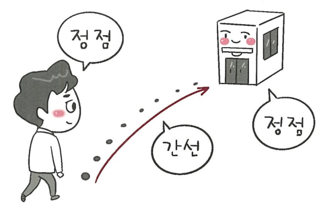 |  |  | 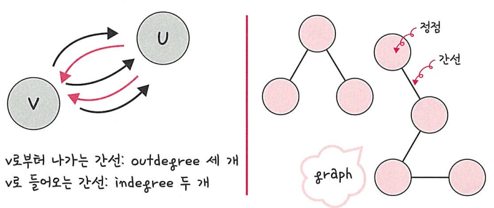 |

<br>

#### ➕ 추가 정보
- 노드 간의 연결 관계를 표현

<details>
  <summary><b>예제 코드</b></summary>

```java
import java.util.*;

public class GraphExample {
    private Map<String, List<String>> graph = new HashMap<>();

    // 노드 추가
    public void addVertex(String vertex) {
        graph.putIfAbsent(vertex, new ArrayList<>());
    }

    // 간선 추가 (양방향)
    public void addEdge(String a, String b) {
        graph.get(a).add(b);
        graph.get(b).add(a);
    }

    // 그래프 출력
    public void printGraph() {
        for (String v : graph.keySet()) {
            System.out.println(v + " → " + graph.get(v));
        }
    }

    public static void main(String[] args) {
        GraphExample g = new GraphExample();
        g.addVertex("A");
        g.addVertex("B");
        g.addVertex("C");

        g.addEdge("A", "B");
        g.addEdge("A", "C");
        g.addEdge("B", "C");

        System.out.println("그래프 인접 리스트:");
        g.printGraph();
    }
}
```
출력 결과
```
그래프 인접 리스트:
A → [B, C]
B → [A, C]
C → [A, B]
```

</details>

<br>

### 5.3.2 트리
- 그래프중 하나로 **정점**과 **간선**으로 이주어짐
- 트리 구조로 배열된 일종의 **계층적 데이터**의 집합

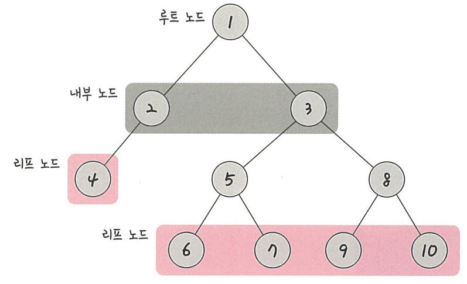

#### 특징
- 부모, 자식 계층 구조를 가짐
- V - 1 = E(노드 수 - 1 = 간선 수)
- 두 노드 사이의 경로는 유일무이하게 존재함(트리 내의 노드 사이의 경로는 반드시 존재)

#### 구성
- **루트 노드, 내부 노드, 리프 노드**로 이루어짐

|  구성   |           설명           |
|:-----:|:----------------------:|
| 루트 노드 |      가장 위에 있는 노드       |
| 리프 노드 | 루트 노드와 내부 노드 사이에 있는 노드 |
| 내부 노드 |      자식 노드가 없는 노드      |

<br>

#### 높이와 레벨
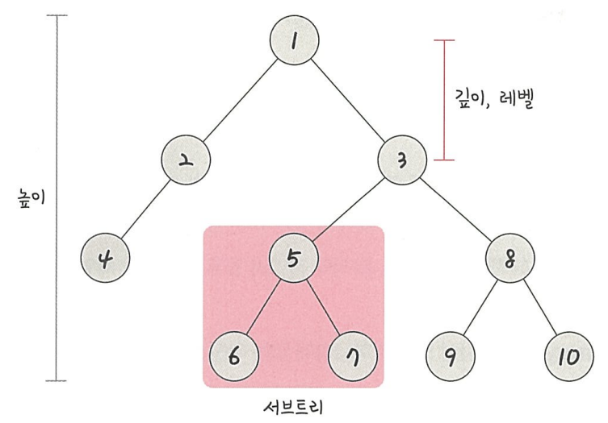

|           깊이           |             높이              |                   레벨                   |    서브트리     |
|:----------------------:|:---------------------------:|:--------------------------------------:|:-----------:|
| 루트 노드부터 특정 노드까지의 최단 거리 | 루트 노드부터 리프 노드까지 거리중 가장 긴 거리 |             깊이와 같은 의미를 지님              | 트리 내의 하위 집합 |
|      4번 노드의 깊이는 2      |            높이 3             | 1번 노드를 1레벨이라고 한다면 2번 노드와 3번 노드는 2레벨이 됨 | 5번, 6번, 7번  |

<br>

#### ➕ 추가 정보
- 계층적 구조를 표현하는 비순환 그래프
- 루트(root) 노드에서 시작해 자식(child) 노드로 확장됨

<details>
  <summary><b> 예제 코드</b></summary>

```java
class Node {
    int value;
    Node left, right;

    Node(int value) {
        this.value = value;
        left = right = null;
    }
}

public class TreeExample {
    Node root;

    // 중위 순회 (Left → Root → Right)
    void inorder(Node node) {
        if (node != null) {
            inorder(node.left);
            System.out.print(node.value + " ");
            inorder(node.right);
        }
    }

    public static void main(String[] args) {
        TreeExample tree = new TreeExample();
        tree.root = new Node(1);
        tree.root.left = new Node(2);
        tree.root.right = new Node(3);
        tree.root.left.left = new Node(4);
        tree.root.left.right = new Node(5);

        System.out.println("트리 중위 순회 결과:");
        tree.inorder(tree.root);
    }
}
```
출력 결과
```
트리 중위 순회 결과:
4 2 5 1 3
```
</details>

<br>

#### 이진 트리
- 자식의 노드 수가 **두 개 이하**인 트리

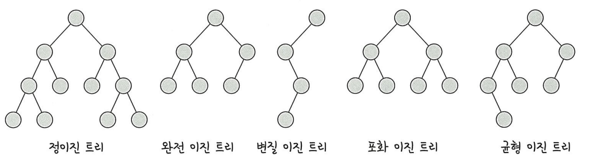

|    종류    |             설명              |
|:--------:|:---------------------------:|
|  정이진 트리  |     자식 노드가 0 또는 두 개인 트리     |
| 완전 이진 트리 |       왼쪽부터 채워져 있는 트리        |
| 변질 이진 트리 |      자식 노드가 하나밖에 없는 트리      |
| 포화 이진 트리 |      모든 노드가 꽉 차 있는 트리       |
| 균형 이진 트리 | 외쪽과 오른쪽 노드의 높이 차이가 1 이하인 트리 |


<br>

#### 이진 탐색 트리
- 오른쪽 하위 트리에는 **노드 값보다 큰 값**이 있는 노드, 왼쪽 하위 트리에는 **노드 값보다 작은 값**이 들어 있음
- 검색에 용이함
- 시간 복잡도 : 평균 O(logn), 최악(선형적) O(n)
- 삽입 순서에 따라 선형적일 수 있음

|        이진 탐색 트리         |    선형적인 이진 탐색 트리 비교     |
|:-----------------------:|:-----------------------:|
| 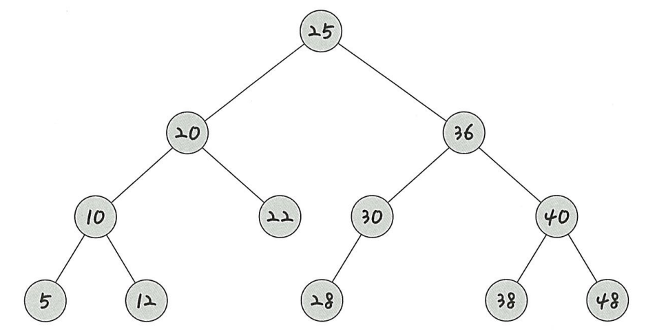 | 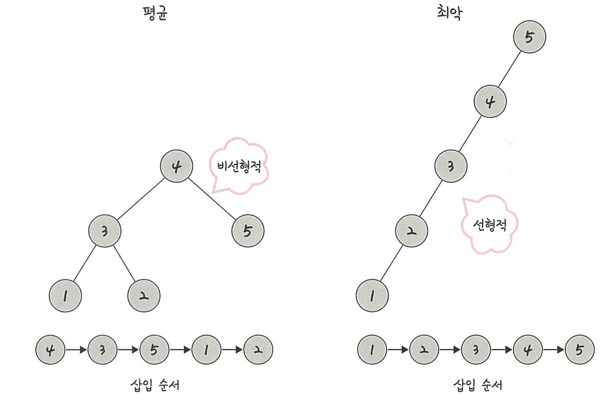 |

<br>

#### AVL 트리
- 선형적인 트리가 되는 것을 방지하고 스스로 균형을 잡는 트리
- 두 자식 서브트리의 높이는 항상 최대 1만큼 차이남

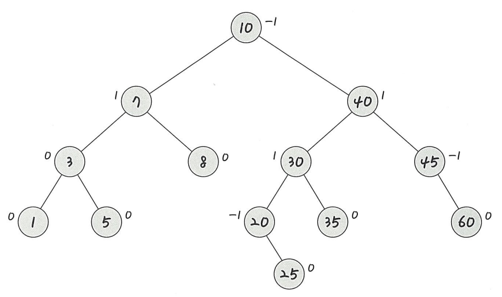

<br>

#### 레드 블랙 트리
- 균형 이진 탐색트리
- 시간 복잡도 : O(logn)
- 빨간색 또는 검은색의 색상을 나타내는 추가 비트를 저장
- 삽입, 삭제 중에 트리가 균형을 유리하도록 사용됨
- 모든 리프 토드와 루트 노드는 블랙이고 어떤 노드가 레드면 그 노드의 자식은 반드시 블랙


<br>

### 5.3.3 힙
- 완전 이진 트리 기반의 자료 구조
- **최소힙**과 **최대힙** 두가지가 있음
- 힙에 어떤 값이 들어와도 특정한 힙의 규칙을 지킴

| 특징  |                설명                 |
|:---:|:---------------------------------:|
| 최대힙 | 루트 노드에 있는 키는 모든 자식에 있는 키중 가장 커야함  |
| 최소힙 | 루트 노드에 있는 키는 모든 자식에 있는 키중 가장 작아야함 |

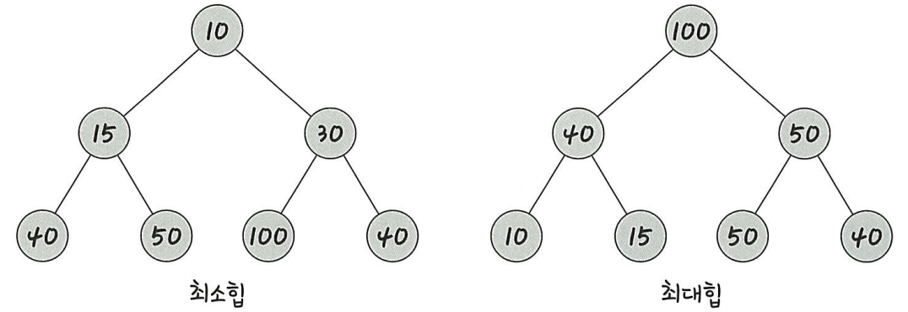

<br>

#### 최대힙
삽입 절차 
1. 힙에 새로운 요소가 들어옴
2. 일단 새로운 노드를 힙의 마지막 노드에 삽입
3. 새로운 노드를 부모 노드와 크기 비교하며 교환

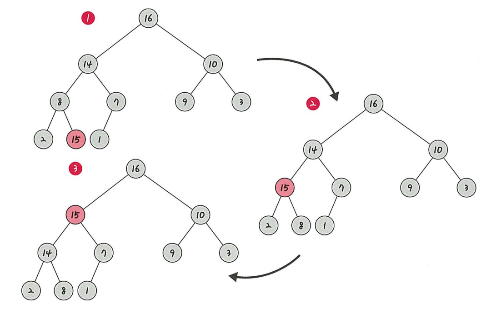

8이라는 값을 가진 노드 및에 15의 값을 삽입 -> 노드가 점차 올라가면서 해당 노드 위에 있는 노드와 스왑

삭제 절차
1. 최대값은 루트 노드이므로 루트 노드 삭제
2. 마지막 노드와 루트 노드를 스왑

<br>

#### ➕ 추가 정보
- 최대 힙(Max Heap): 부모 노드 ≥ 자식 노드
- 최소 힙(Min Heap): 부모 노드 ≤ 자식 노드

<details>
  <summary><b> 예제 코드</b></summary>

```java
import java.util.*;

public class HeapExample {
    public static void main(String[] args) {
        // 최소 힙 (기본)
        PriorityQueue<Integer> minHeap = new PriorityQueue<>();
        // 최대 힙
        PriorityQueue<Integer> maxHeap = new PriorityQueue<>(Comparator.reverseOrder());

        int[] numbers = {5, 2, 8, 1, 3};
        for (int n : numbers) {
            minHeap.add(n);
            maxHeap.add(n);
        }

        System.out.println("Min Heap (오름차순):");
        while (!minHeap.isEmpty()) {
            System.out.print(minHeap.poll() + " ");
        }

        System.out.println("\nMax Heap (내림차순):");
        while (!maxHeap.isEmpty()) {
            System.out.print(maxHeap.poll() + " ");
        }
    }
}
```
출력 결과
```
Min Heap (오름차순):
1 2 3 5 8
Max Heap (내림차순):
8 5 3 2 1
```
</details>

<br>

### 5.3.4 우선순위 큐
- 우선순위가 높은 요소가 우선순위보다 낮은 요소보다 먼저 제공됨
- 힙을 기반으로 구현됨

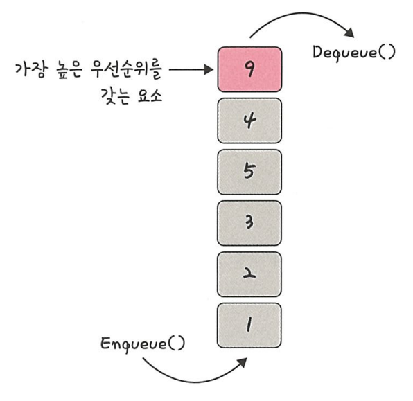

<br>

#### ➕ 추가 정보

<details>
  <summary><b> 예제 코드</b></summary>

```java
import java.util.PriorityQueue;

public class PriorityQueueExample {
    public static void main(String[] args) {
        PriorityQueue<Integer> pq1 = new PriorityQueue<>();
        PriorityQueue<Integer> pq2 = new PriorityQueue<>(Comparator.reverseOrder());

        pq1.add(5);
        pq1.add(1);
        pq1.add(3);
        
        pq2.add(5);
        pq2.add(1);
        pq2.add(3);

        System.out.println("오름 차순: ");
        while (!pq1.isEmpty()) {
            System.out.print(pq1.poll() + " / ");
        }

        System.out.println("\n내림 차순: ");
        while (!pq2.isEmpty()) {
            System.out.print(pq2.poll() + " / ");
        }
    }
}
```
출력 결과
```
오름 차순
1 / 3 / 5
내림차순
5 / 3 / 1
```
</details>

<br>

### 5.3.5 맵
- **키(key)** 와 **값(value)** 의 조합의 구조

<br>

#### ➕ 추가 정보
- 대표적으로 HashMap, TreeMap 등이 있음
- 저장 순서를 유지하지 않음
- 키는 중복을 허용하지 않음(값은 중복 허용)

|   종류    |       특징       |
|:-------:|:--------------:|
| HashMap |  순서가 유지되지 않음   |
| TreeMap | 키 기준으로 오름차순 정렬 |


사용 함수

|       함수        |           뜻            |
|:---------------:|:----------------------:|
|      put()      | 키와 값 저장(이미 값이 있으면 덮어씀) |
|      get()      |      키에 대한 값을 조회       |
|  containsKey()  | 키가 있으면 true, 없으면 false |
| containsValue() | 값이 있으면 true, 없으면 false |
|    keySet()     |        키만 모두 조회        |
|    values()     |        값만 모두 조회        |
|    remove()     |     키에 대한 키와 값을 제거     |
|     size()      |     키와 값의 총 개수 조회      |
|    replace()    |     키에 대한 값을 업데이트      |

<details>
  <summary><b>예제 코드</b></summary>

```java
import java.util.*;

public class MapExample {
    public static void main(String[] args) {
        // HashMap 생성 (정렬되지 않음)
        Map<String, Integer> hashMap = new HashMap<>();

        // put() - 값 추가
        hashMap.put("사과", 3);
        hashMap.put("바나나", 5);
        hashMap.put("포도", 2);

        // get() - 값 조회
        System.out.println("사과의 개수: " + hashMap.get("사과"));

        // containsKey(), containsValue()
        System.out.println("키 '바나나' 존재 여부: " + hashMap.containsKey("바나나"));
        System.out.println("값 5 존재 여부: " + hashMap.containsValue(5));

        // keySet(), values()
        System.out.println("모든 키: " + hashMap.keySet());
        System.out.println("모든 값: " + hashMap.values());

        // size() - 전체 개수
        System.out.println("전체 항목 수: " + hashMap.size());

        // replace() - 값 변경
        hashMap.replace("포도", 10);
        System.out.println("포도 개수 수정 후: " + hashMap.get("포도"));

        // remove() - 항목 삭제
        hashMap.remove("바나나");
        System.out.println("바나나 삭제 후: " + hashMap);

        // TreeMap 생성 (키 기준으로 자동 정렬)
        Map<String, Integer> treeMap = new TreeMap<>(hashMap);
        treeMap.put("딸기", 7);
        System.out.println("TreeMap (정렬된 출력): " + treeMap);
    }
}
```
출력 결과
```
사과의 개수: 3
키 '바나나' 존재 여부: true
값 5 존재 여부: true
모든 키: [사과, 바나나, 포도]
모든 값: [3, 5, 2]
전체 항목 수: 3
포도 개수 수정 후: 10
바나나 삭제 후: {사과=3, 포도=10}
TreeMap (정렬된 출력): {딸기=7, 사과=3, 포도=10}
```
</details>

<br>

### 5.3.6 셋
- 특정 순서에 따라 고유한 요소를 저장
- 중복되는 값이 없음

<br>

#### ➕ 추가 정보
- 대표적으로 HashSet, TreeSet, LinkedHashSet 등이 있음


|        종류         |      특징      |
|:-----------------:|:------------:|
|      HashSet      | 순서 없음, 빠른 검색 |
|   LinkedHashSet   |  입력한 순서 유지   |
|      TreeSet      | 자동 정렬(오름차순)  |

<details>
  <summary><b>예제 코드</b></summary>

```java
import java.util.*;

public class SetExample {
    public static void main(String[] args) {
        // HashSet 생성 (순서 없음)
        Set<String> fruits = new HashSet<>();

        // add() - 값 추가 (중복은 자동으로 제거됨)
        fruits.add("사과");
        fruits.add("바나나");
        fruits.add("포도");
        fruits.add("바나나"); // 중복 추가 시 무시됨

        // 출력
        System.out.println("HashSet: " + fruits);

        // contains() - 포함 여부 확인
        System.out.println("포도가 포함되어 있나요? " + fruits.contains("포도"));

        // remove() - 요소 삭제
        fruits.remove("사과");
        System.out.println("사과 삭제 후: " + fruits);

        // size() - 크기 확인
        System.out.println("요소 개수: " + fruits.size());

        // for-each 반복문으로 순회
        System.out.println("모든 요소 출력:");
        for (String fruit : fruits) {
            System.out.println(fruit);
        }

        // TreeSet 생성 (자동 정렬)
        Set<String> sortedFruits = new TreeSet<>(fruits);
        sortedFruits.add("딸기");
        System.out.println("TreeSet (정렬된 출력): " + sortedFruits);
    }
}
```
출력 결과
```
HashSet: [포도, 사과, 바나나]
포도가 포함되어 있나요? true
사과 삭제 후: [포도, 바나나]
요소 개수: 2
모든 요소 출력:
포도
바나나
TreeSet (정렬된 출력): [딸기, 바나나, 포도]
```
</details>

<br>

### 5.3.6 해시 테이블
- 무한에 가까운 데이터들을 유한한 개수의 해시 값으로 매핑
- 삽입, 삭제, 탐색시 O(1)의 시간 복잡도를 가짐
- 특정 키에 대한 검색이 빠름

<br>

#### ➕ 추가 정보
- 키를 해시 함수를 통해 숫자로 변환
- 그 숫자를 인덱스로 사용해 데이터를 빠르게 저장하고 검색
- 데이터를 **키(key)** 와 **값(value)** 의 쌍으로 매핑
- 같은 해시값이 발생하는 경우 -> 해시 충돌(Hash Collision) → LinkedList 나 Tree 구조로 해결

```
자바에서는 Hashtable 클래스가 바로 해시 테이블을 구현한 것
Hashtable 은 스레드 안전(Thread-safe) 하지만 동기화로 인해 속도가 느림
따라서, 현재는 HashMap 이 더 자주 사용됨 
```

<details>
  <summary><b>예제 코드</b></summary>

```java
import java.util.Hashtable;

public class HashTableExample {
    public static void main(String[] args) {
        // Hashtable 생성 (key: String, value: Integer)
        Hashtable<String, Integer> table = new Hashtable<>();

        // put() - 값 추가
        table.put("사과", 3);
        table.put("바나나", 5);
        table.put("포도", 2);

        // get() - 값 조회
        System.out.println("사과의 개수: " + table.get("사과"));

        // containsKey(), containsValue()
        System.out.println("바나나 키 존재? " + table.containsKey("바나나"));
        System.out.println("값 5 존재? " + table.containsValue(5));

        // remove() - 항목 삭제
        table.remove("포도");

        // keySet()과 elements() 사용
        System.out.println("\n현재 남은 과일 목록:");
        for (String key : table.keySet()) {
            System.out.println(key + " → " + table.get(key));
        }

        // size()
        System.out.println("\n총 항목 수: " + table.size());
    }
}
```
출력 결과
```
사과의 개수: 3
바나나 키 존재? true
값 5 존재? true

현재 남은 과일 목록:
바나나 → 5
사과 → 3

총 항목 수: 2
```

</details>

<br>

#### HashMap vs Hashtable

|        구분         |      HashMap       |  Hashtable   |
|:-----------------:|:------------------:|:------------:|
| 동기화(Synchronized) |      비동기 (빠름)      | 동기화 (스레드 안전) |
|      null 허용      | 가능 (key/value 둘 다) |     불가능      |
|       권장 사용       |      일반적인 경우       | 멀티스레드 환경에서만  |

단일 스레드에서는 HashMap 멀티 스레드 환경에서는 Hashtable를 사용
